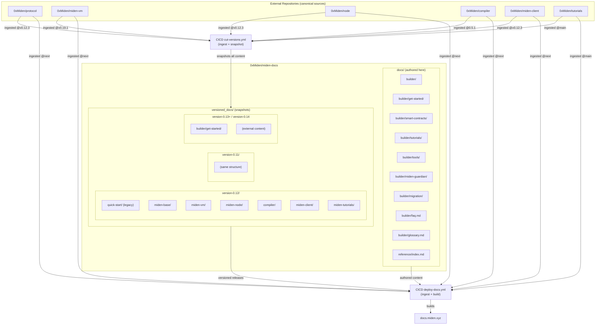

# miden-docs

Consolidated documentation for the Miden rollup

---

## Documentation Dependency & Versioning Model

This documentation site combines content **authored in this repo** with content **ingested from external Miden repositories**. Understanding this ownership model is critical for contributors.

### Dependency Diagram



### Content Ownership

| Category | Location | Source | Example |
|----------|----------|--------|---------|
| **Authored** | `docs/builder/` | Written in this repo | `docs/builder/get-started/`, `docs/builder/faq.md` |
| **Ingested (live)** | `docs/reference/`, `docs/builder/` | External repos @ next | `docs/reference/protocol/`, `docs/builder/tutorials/` |
| **Ingested (versioned)** | `versioned_docs/` | External repos @ release tags | `versioned_docs/version-0.12/protocol/` |
| **Snapshots** | `versioned_docs/` | Frozen via `docs:version` | All versioned content |

### What Each Location Contains

**`docs/` (current/next version)**
- Get Started guides (`docs/builder/get-started/`)
- Reference and Smart Contracts placeholders
- FAQ and Glossary
- Landing pages for Builder and Reference

**`versioned_docs/` (frozen releases)**
- Snapshots of `docs/` at release time
- Ingested external content (Protocol, VM, Compiler, Node, Client, Tutorials)
- Each version is immutable after creation

### Why Content Appears in Both Places

When `docusaurus docs:version X.Y` runs, it snapshots **everything in `docs/`** into `versioned_docs/version-X.Y/`. This is versioning, not duplication:

- `docs/builder/get-started/` → edited live, appears in "current/next"
- `versioned_docs/version-0.12/quick-start/` → frozen snapshot from release 0.12

**External content is never copied into `docs/`** because:
1. It would create content drift between source repos and this site
2. The ingestion workflow would overwrite manual edits
3. Contributors wouldn't know which copy is canonical

### Legacy Note

Older versioned snapshots (0.11, 0.12) contain `quick-start/` at the root level. New versions will snapshot `builder/get-started/` inside the builder directory.

---

## How to Cut and Deploy a New Docs Release

### When to Cut a New Version

Cut a new documentation version when:
- A new protocol release ships (protocol, miden-vm, node, compiler)
- Client or tutorial content has significant updates
- Authored content (Get Started, FAQ, Glossary) needs to be frozen for a release

### Steps to Cut a Release

#### 1. Update the Release Manifest

Edit `.release/release-manifest.yml`:

```yaml
version: "0.14"  # New version label

refs:
  protocol: refs/tags/v0.14.4       # Pin to release tag
  miden-vm: refs/tags/v0.22.1
  node: refs/tags/v0.14.9
  compiler: refs/tags/v0.8.1
  miden-client: refs/tags/v0.14.4
  tutorials: refs/heads/main        # Or specific commit/tag
```

#### 2. Run the Version Cut Workflow

> **Important:** Run this workflow on a **branch** (not `main`). The workflow commits the snapshot
> to the current branch, allowing you to review changes in a PR before merging to `main`.
> The workflow is configured to NOT run automatically when changes are pushed to `main`.

Trigger `.github/workflows/cut-versions.yml` on a branch (manually via `workflow_dispatch`, or by pushing the updated manifest to the branch):

The workflow executes these steps:
1. **Checkout external repos** at pinned refs
2. **Aggregate docs temporarily** into `docs/` (protocol/, miden-vm/, etc.)
3. **Run `docusaurus docs:version X.Y`** to snapshot everything
4. **Clean up `docs/`** — remove aggregated external content
5. **Commit `versioned_docs/version-X.Y/`** to the repository

After the workflow completes:
- `versioned_docs/version-X.Y/` contains the frozen snapshot
- `docs/` returns to authored-only content
- `versions.json` is updated with the new version

#### 3. Merge the Generated Snapshot

The workflow commits directly to the branch. Review and merge to `main`.

### Steps to Deploy

Deployment is **automatic** on push to `main`.

The `.github/workflows/deploy-docs.yml` workflow:
1. Checks out this repository and all external source repos
2. Ingests external docs into v0.4 IA structure:
   - Reference docs → `docs/reference/protocol/`, `miden-vm/`, `compiler/`, `node/`
   - Builder docs → `docs/builder/tutorials/`, `docs/builder/tools/client/`
3. Runs `npm run build` to generate the static site
4. Deploys to GitHub Pages at `docs.miden.xyz`

The build uses:
- `docs/` → serves as "current/next" version (authored + ingested content)
- `versioned_docs/` → serves as versioned releases (0.11, 0.12, etc.)

**Both workflows ingest external content**, but with different purposes:
- `deploy-docs.yml` → live "next" docs from `next` branch of source repos
- `cut-versions.yml` → versioned snapshots at pinned release tags

---

## Contributor Guidelines

### ✅ DO

- Edit Get Started content in `docs/builder/get-started/`
- Edit FAQ and Glossary in `docs/builder/`
- Edit Protocol/VM/Compiler/Node docs **in their source repositories**
- Cut a new version to publish external documentation changes
- Use `cut-versions.yml` to create release snapshots

### ❌ DON'T

- **Never** manually copy external content into `docs/` (use CI/CD ingestion)
- **Never** create root-level `docs/protocol/`, `docs/miden-vm/`, etc. (use nested paths in `docs/reference/`)
- **Never** edit `versioned_docs/` directly (snapshots are immutable)
- **Never** create a root-level `docs/quick-start/` (Get Started lives in `docs/builder/`)

### Quick Reference

| Task | Action |
|------|--------|
| Edit Get Started | `docs/builder/get-started/` |
| Edit FAQ/Glossary | `docs/builder/faq.md`, `docs/builder/glossary.md` |
| Edit Protocol docs | `0xMiden/protocol` repo → cut new version |
| Edit VM docs | `0xMiden/miden-vm` repo → cut new version |
| Edit Tutorials | `0xMiden/tutorials` repo → cut new version |
| Edit Client docs | `0xMiden/miden-client` repo → cut new version |
| Create new release | Update `.release/release-manifest.yml` → run `cut-versions.yml` |

---

## Analytics & Indexing

### Analytics Configuration

The site uses **Simple Analytics** for privacy-first, cookie-less metrics.

| Provider | Purpose | Configuration |
|----------|---------|---------------|
| **Simple Analytics** | Privacy-first baseline metrics | `scripts` array in `docusaurus.config.ts` |

### Verification in Production

**Simple Analytics:**
- Dashboard: https://simpleanalytics.com/miden.xyz

### Indexing Files

| File | URL | Purpose |
|------|-----|---------|
| `static/llms.txt` | `/llms.txt` | LLM-friendly entry points |
| `static/skill.md` | `/skill.md` | Compact assistant skill and route map |
| `static/robots.txt` | `/robots.txt` | Crawler directives |
| (auto-generated) | `/sitemap.xml` | Search engine sitemap |

### Updating LLM-facing files

Edit `static/llms.txt` and `static/skill.md` directly. Content should:
- List canonical current entry points for Builder, clients, tutorials, Guardian, and Reference
- Call out `/` as the latest stable docs and `/next/` as the current unstable docs
- Avoid stale paths such as `builder/develop/` or old `miden-base` source links
- Avoid "Polygon Miden" branding (use "Miden" only)
