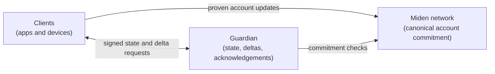
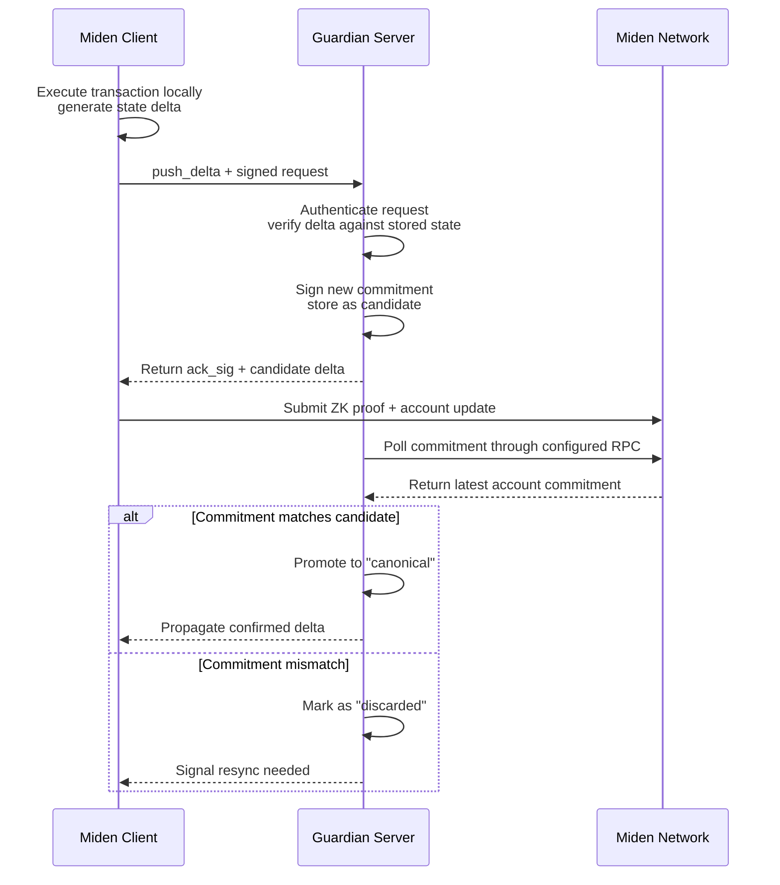
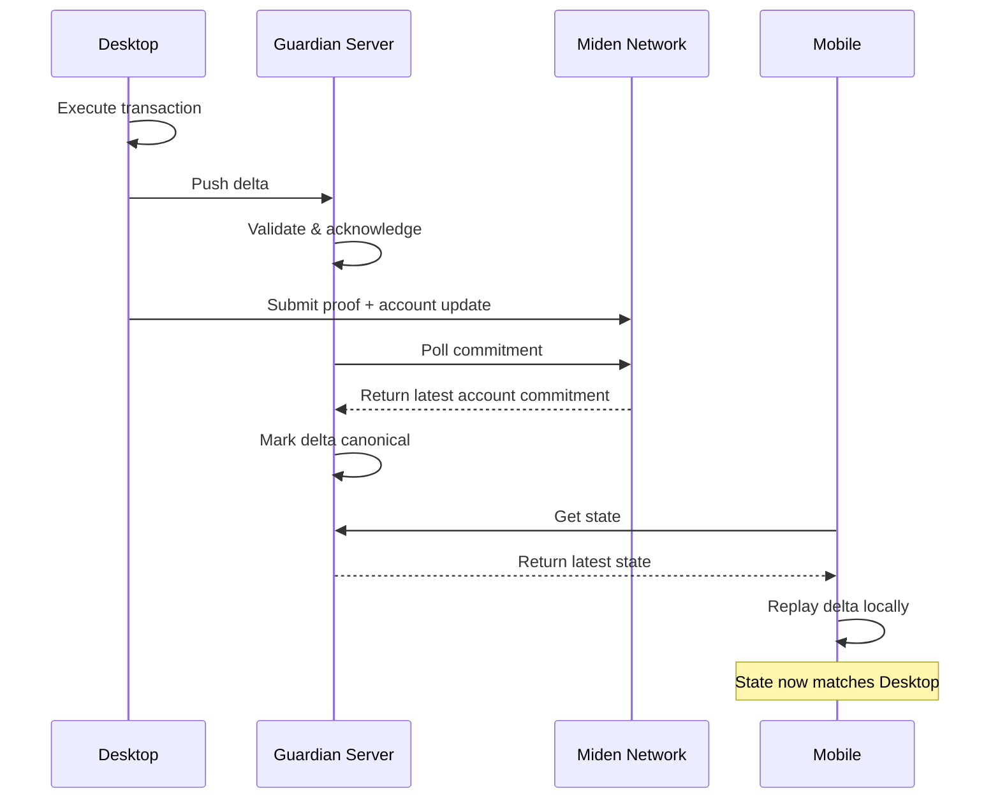
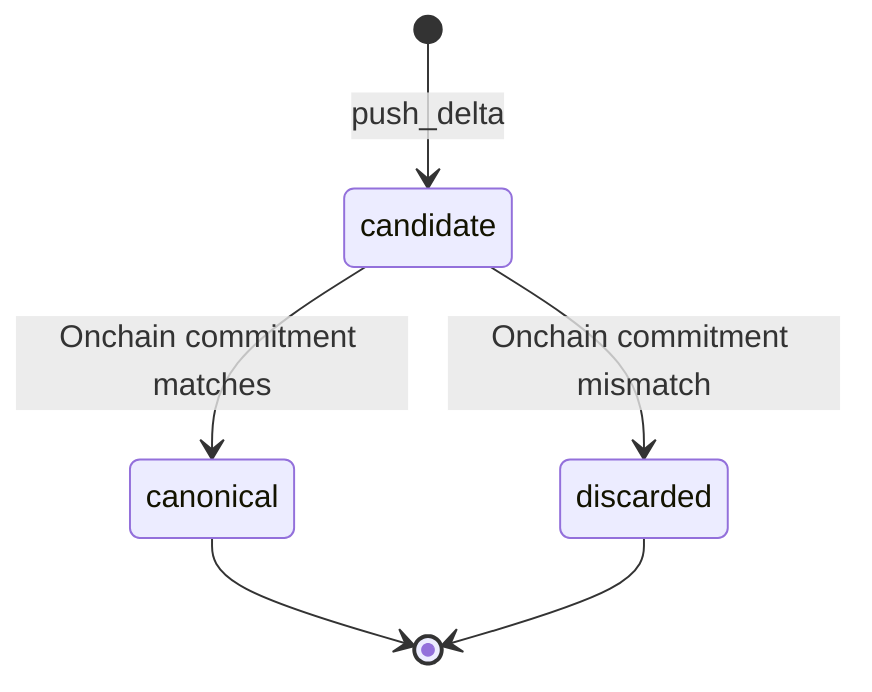

# Architecture

Guardian sits between Miden clients and the Miden network. It is an offchain coordination layer for private account state, not the canonical source of account validity. Miden remains authoritative for account commitments; Guardian helps authorized clients keep the private state behind those commitments available, fresh, and synchronized.

## System overview

- **Clients** execute transactions, prove account updates, manage local state, sign Guardian requests, and verify any state returned by Guardian.
- **Guardian** authenticates clients, stores state snapshots and deltas, acknowledges accepted deltas, and coordinates proposals.
- **Miden network** remains the source of truth for account commitments and accepts the proven account updates submitted by clients.

Each account is independently configured on Guardian with its own authentication policy and storage. Clients interact with Guardian through either gRPC or HTTP - both interfaces expose the same semantics.

## Design goals and non-goals

| Category | Guardian does | Guardian does not |
|---|---|---|
| **State availability** | Stores state snapshots and replayable deltas for authorized clients. | Publish private state to Miden or make it globally readable. |
| **Synchronization** | Helps clients converge on the latest canonical state. | Replace local client verification. |
| **Integrity** | Links deltas with commitments and signs accepted updates. | Make the server's database authoritative if it conflicts with Miden. |
| **Custody** | May participate as one configured key in a threshold account. | Move funds by itself. |
| **Privacy** | Restricts API access to authenticated clients. | Hide submitted payloads from the server operator by default. |

This distinction matters: Guardian improves recovery and coordination for Miden's private-account model, while preserving the core rule that account updates are valid only when the Miden network accepts the resulting commitment.

## Data and trust boundaries

| Boundary | Data crossing it | Protection |
|---|---|---|
| Client -> Guardian | Initial state, deltas, proposal payloads, signatures, timestamps. | Per-account signatures, replay protection, request-size limits, and rate limits. |
| Guardian -> Client | Latest state, merged deltas, proposals, acknowledgement signatures. | Client verifies the Guardian acknowledgement key and commitment chain. |
| Client -> Miden network | Proven account updates and resulting commitments. | Miden verification and account-update rules. |
| Guardian -> Miden network | Account identifiers and commitment queries. | Network verification through a configured RPC endpoint. |
| Inside Guardian | Metadata, state snapshots, deltas, proposals, auth timestamps. | Backend access control, deployment security, and commitment-chain verification by clients. |

The Guardian operator is trusted for availability and for protecting its infrastructure. The operator is not trusted with unilateral custody, and clients should not treat the database as authoritative unless the returned commitments and acknowledgments verify.

## State lifecycle

Transactions proceed through a step-by-step process to ensure consistency and verifiability:

1. **Local execution**: The user computes a transaction locally, generating a delta (state change).
2. **Delta submission**: The client signs the request and submits the delta to Guardian.
3. **Guardian acknowledgment**: Guardian validates the request, applies the delta to the stored state, computes the new commitment, and signs the accepted commitment.
4. **Proof submission**: The client submits the proven account update to Miden.
5. **Canonical confirmation**: Guardian checks the network commitment. If it matches the candidate, the delta becomes canonical and can be served to other clients.

## Multi-device sync

For users with multiple devices, Guardian keeps state synchronized seamlessly:

The desktop executes a transaction and pushes the delta to Guardian. After the account update is accepted by Miden and Guardian confirms the commitment, Guardian propagates the canonical delta to the mobile client, which replays it locally without querying the network directly.

The receiving device should still verify:

- the returned state or delta chain links to the expected commitment,
- the Guardian acknowledgement signature is from the expected server key,
- the local account state after replay matches the commitment it expects to use.

## Account management

Accounts are configured with per-account authentication based on public keys (commitments). During setup, Guardian records which keys are authorized to manage the account.

For each request, the client signs a payload with one of those keys and the server verifies the signature against the account's authorized keys. See [Components](./components.md) for details on the auth model.

## Canonicalization

Canonicalization is the process of validating that a candidate delta matches the account commitment accepted by Miden. It is optional and mainly used in multi-user setups.

- **Candidate mode** (default): A background worker polls for candidate deltas, checks them against the Miden network, and promotes or discards them based on verification results.
- **Optimistic mode**: Deltas become canonical immediately, skipping the verification window.

| Parameter | Builder API default | Description |
|---|---|---|
| `check_interval_seconds` | 10 | How often the worker scans for candidate deltas. |
| `max_retries` | 18 | Verification attempts before discarding a candidate after the grace period. |
| `submission_grace_period_seconds` | 600 (10 min) | Minimum candidate age before verification failures consume retry budget. |

The reference server binary uses a 10-second check interval, 48 retries, and a 10-minute submission grace period. Embedders using the builder API can configure canonicalization directly in code.

## Failure and recovery model

| Failure | Effect | Recovery path |
|---|---|---|
| Guardian unavailable | Clients cannot fetch backups, sync deltas, or gather Guardian-assisted signatures. | Use local state if available, retry later, or rotate to another provider with recovery keys. |
| Candidate does not match Miden commitment | Guardian marks the candidate as discarded. | Client resyncs from the latest canonical state and rebuilds the transaction. |
| Client submits stale delta | Guardian rejects the delta because `prev_commitment` does not match the active chain. | Client fetches state or `delta/since`, replays canonical deltas, then retries. |
| Guardian withholds updates | Other clients may see stale state. | Compare against Miden commitment and use recovery/provider-rotation flow if needed. |
| Guardian database is corrupted | Returned state may fail commitment or acknowledgement checks. | Client rejects unverifiable data and recovers from another backup or provider. |

## Common use cases

- **Single-user accounts**: Back up and sync state securely. If a device is lost, recover state from Guardian.
- **Multi-user accounts**: Coordinate state and transactions between participants. Guardian helps keep everyone on the latest canonical state.
