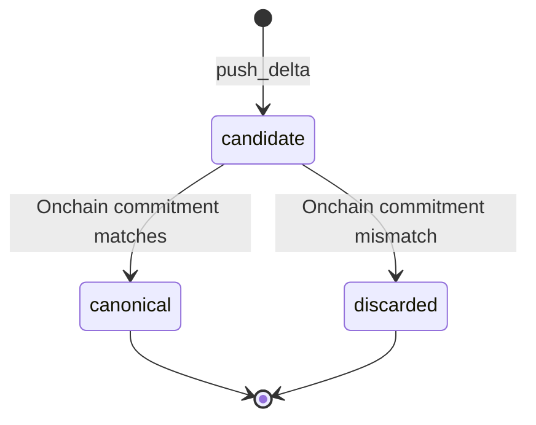
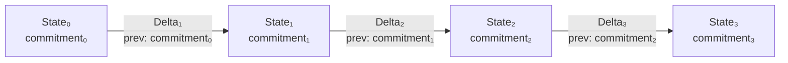
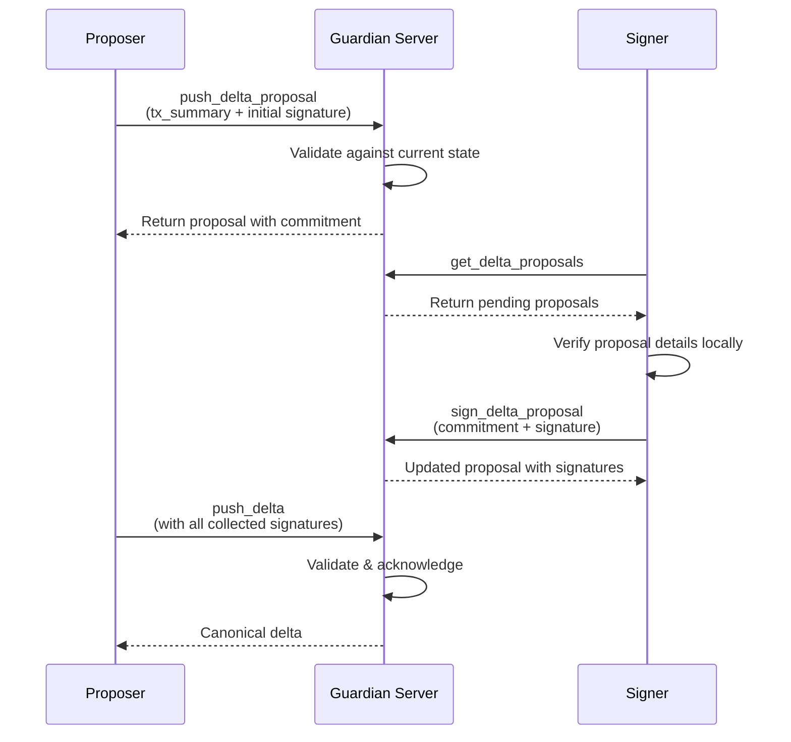

# Data Structures

Guardian models account state as an append-only chain of snapshots and changes.

The key design idea is simple: Guardian can help clients recover and synchronize state, but the state remains verifiable because each delta links to the previous commitment and produces a new commitment.

## State

A **state** is a snapshot of an account at a point in time. Guardian treats the account payload as client-supplied state data and tracks it with the account ID, commitment, timestamps, and auth scheme.

Guardian's HTTP representation is a `StateObject`:

```json
{
  "account_id": "0xabc123",
  "state_json": {
    "data": "<base64-encoded serialized account state>"
  },
  "commitment": "0xdef456",
  "created_at": "2026-05-16T00:00:00Z",
  "updated_at": "2026-05-16T00:00:00Z",
  "auth_scheme": "falcon"
}
```

The `state_json` object is opaque to Guardian. For Miden accounts, the client SDK typically packs serialized account state into a `data` field; other examples in this section are illustrative unless called out as exact API shapes.

When you first register an account with Guardian, you provide an **initial state** - the baseline from which all subsequent changes are tracked.

## Delta

A **delta** represents a set of changes applied to a state. Deltas are append-only. Each delta references the commitment of the state it was applied to, forming an unbroken chain.

```json
{
  "account_id": "0xabc123",
  "nonce": 11,
  "prev_commitment": "0xdef456",
  "new_commitment": "0x789abc",
  "delta_payload": {
    "data": "<base64-encoded TransactionSummary>"
  },
  "ack_sig": "0x...",
  "ack_pubkey": "0x...",
  "ack_scheme": "falcon",
  "status": {
    "status": "candidate",
    "timestamp": "2026-05-16T00:00:00Z",
    "retry_count": 0
  }
}
```

A useful mental model: a delta is a compact, replayable description of "what changed" in an account's local state. Deltas can sync, back up, and reconstruct state without shipping full snapshots.

`new_commitment` is present once Guardian has acknowledged a delta. Pending proposals do not have a resulting commitment yet, so the field is omitted on the wire.

Key properties:

- **Ordered**: Each delta has a nonce that determines its position in the chain.
- **Linked**: The `prev_commitment` field references the state the delta was applied to. This prevents forks - if two deltas reference different base states, the server rejects the conflicting one.
- **Validated**: The server validates each delta against the current stored state. In candidate mode, canonicalization later checks the resulting commitment against the Miden network before marking the delta canonical.
- **Acknowledged**: Once accepted, the server signs the delta's `new_commitment`, providing cryptographic proof that it was processed.

## Visibility

Guardian stores the state and delta payloads submitted by clients. These records are private from unauthorized API callers, but they are sensitive server-side data.

| Record | Who can request it through Guardian | What the operator may observe |
|---|---|---|
| `StateObject` | Authorized account participants. | Full submitted `state_json`, account ID, commitment, timestamps, auth scheme. |
| `DeltaObject` | Authorized account participants. | Delta payload, nonce, previous and new commitments, status, ack metadata. |
| Delta proposal | Authorized account participants. | Transaction summary payload, signer commitments, signatures, proposal metadata. |
| Metadata | Server internals and operator tooling. | Auth policy, network config, last auth timestamp, account identifiers. |

Do not treat Guardian storage as public data. Operators should apply production database controls, and clients should verify commitments before trusting returned state.

### Delta status lifecycle

Each delta goes through a state machine:



| Status | Meaning |
|---|---|
| `candidate` | Accepted by Guardian but not yet verified onchain. Awaiting canonicalization. |
| `canonical` | Verified against the network and permanently recorded. |
| `discarded` | Failed onchain verification. Removed from the active delta chain. |

In **optimistic mode**, deltas skip the `candidate` stage and are immediately marked `canonical`.

Discarded deltas must not be returned by default sync APIs. A client that sees a discarded candidate should resync from the latest canonical state before constructing a new transaction.

## Commitments

A **commitment** is a cryptographic hash that uniquely identifies a particular version of an account's state. Commitments are the integrity backbone of Guardian:



- Each state snapshot has a commitment.
- Each delta includes a `prev_commitment` (the base state) and produces a `new_commitment` (the resulting state).
- The chain ensures that any tampering - inserting, reordering, or dropping deltas - is detectable by any client that tracks commitments.

## Delta proposals

A **delta proposal** is a coordination mechanism for multi-party accounts. When multiple signers must agree on a transaction:

1. **Propose**: One signer creates a delta proposal containing a `TransactionSummary`. Guardian validates the proposal against the current account state.
2. **Sign**: Other authorized account participants fetch the pending proposal, verify it locally, and submit their signatures.
3. **Execute**: Once enough signatures are collected (meeting the threshold), any authorized participant can promote the proposal to a delta via `push_delta`.



Proposals remain in `pending` status until promoted. Once the corresponding delta becomes canonical, the proposal is automatically cleaned up.

Delta proposals have their own commitment, derived from `(account_id, nonce, tx_summary)`, used as a stable identifier.

## Invariants

Clients and operators should preserve these invariants:

- A delta must reference the active previous commitment for the account.
- A canonical delta must match the commitment accepted by Miden.
- A proposal remains pending until enough authorized signatures are collected and the payload is promoted through `push_delta`.
- A matching proposal is deleted once its delta becomes canonical.
- A client should reject state that does not replay to the expected commitment.
