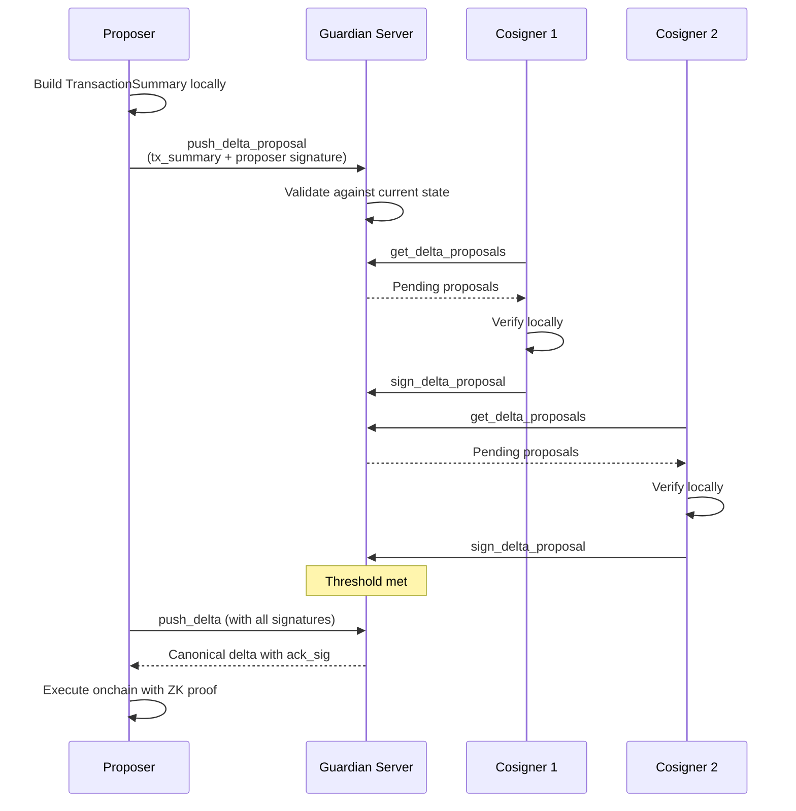
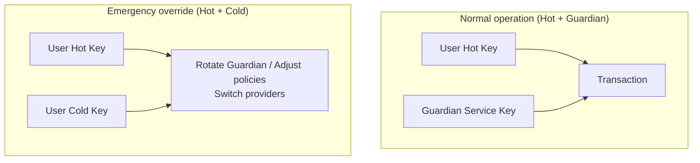
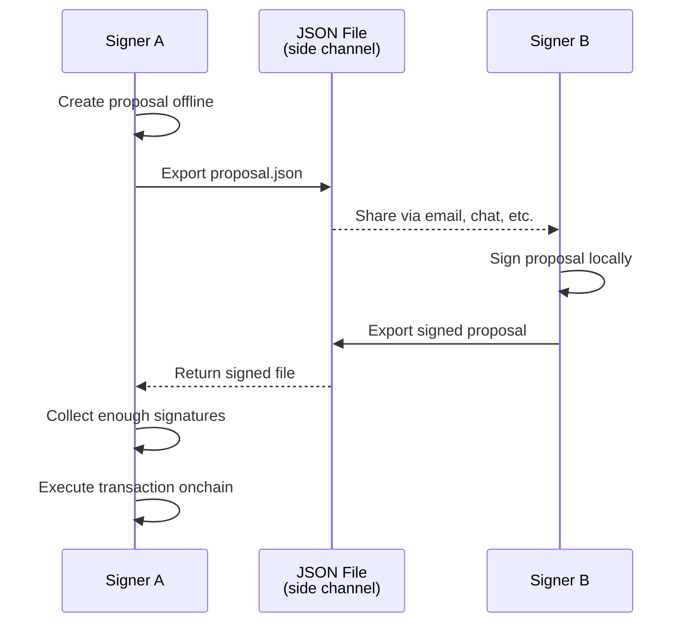

# Core Concepts

## Transaction lifecycle

Every multisig transaction follows the same lifecycle: propose, sign, execute, sync.

1. **Propose**: The proposer builds a `TransactionSummary` locally, signs it, and pushes it to Guardian as a delta proposal.
2. **Sign**: Each cosigner fetches pending proposals, verifies the transaction details against their local state, and submits their signature.
3. **Execute**: Once the threshold is met, any participant pushes the final delta (with all signatures). Guardian returns the acknowledged delta. The executor builds and submits the onchain transaction.
4. **Sync**: All participants fetch the latest state from Guardian to stay synchronized.

## Key architecture: 2-of-3 setup

A common configuration uses a 2-of-3 threshold:

| Key | Holder | Purpose |
|---|---|---|
| **Key 1** | User hot key | Daily transactions |
| **Key 2** | User cold key | Recovery and emergency override |
| **Key 3** | Guardian service key | Co-signing and policy enforcement |

- **Normal operations**: Hot key + Guardian's co-signature are sufficient.
- **Emergency override**: Hot + cold keys alone can rotate out Guardian or switch providers.
- **Guardian alone cannot move funds**: It holds only one key in the threshold.

## Transaction types

| Type | Description |
|---|---|
| **Transfer (P2ID)** | Send assets to another account |
| **Consume notes** | Spend incoming notes |
| **Add signer** | Add a new cosigner to the multisig account |
| **Remove signer** | Remove a cosigner |
| **Change threshold** | Update the required signature count |
| **Switch Guardian** | Change the Guardian provider endpoint |

## Signer types

The TypeScript SDK supports multiple signer backends:

| Signer | Scheme | Use case |
|---|---|---|
| `FalconSigner` | Falcon | Local Falcon key (default) |
| `EcdsaSigner` | ECDSA | Local ECDSA key |
| `ParaSigner` | ECDSA | External EVM wallets via [Para](https://getpara.com) SDK |
| `MidenWalletSigner` | Any | [Miden Wallet](https://github.com/demox-labs/miden-wallet) browser extension |

## Offline fallback

If Guardian is unreachable, the SDKs support fully offline workflows:

1. Create a proposal locally and export it as JSON.
2. Share the file with cosigners through any side channel.
3. Each cosigner signs offline and returns the signed file.
4. Once the threshold is met, execute the transaction onchain.

This ensures multisig operations remain functional even without Guardian connectivity.
