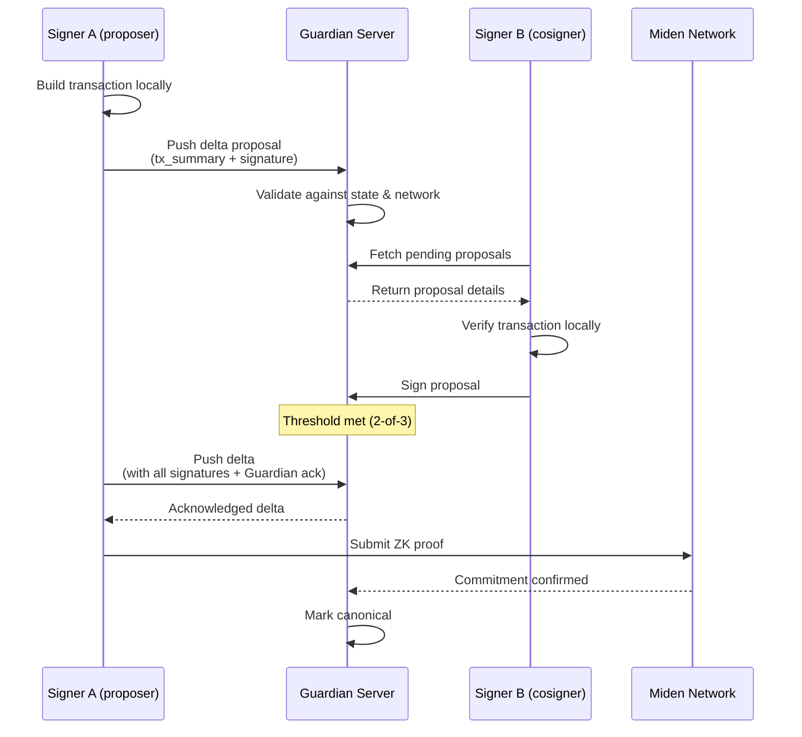

# Private Multisig

Private multisig on Miden allows multiple parties to collectively control an account, requiring a configurable threshold of signatures (N-of-M) to execute transactions — all while keeping account state private.

## The problem

On public chains, multisig coordination is straightforward: every signer can read the same onchain state and build their next action on top of it. Safe-style multisigs work because the ledger is transparent.

In Miden's private account model, account state lives client-side. The chain stores only cryptographic commitments. This means:

- Signers can't independently observe the latest state from the chain.
- Proposals and signatures need an offchain coordination surface.
- Without a shared state view, participants risk divergent state or stale approvals.

The [Miden Guardian](../miden-guardian/) solves this by acting as the coordination server for multisig accounts — keeping signers synchronized, managing proposal workflows, and ensuring all parties work from the same canonical state.

## How it works

Miden multisigs can be fully private (code, signers, metadata, etc. are not visible). Guardian coordinates the workflow:

1. **Propose**: A signer pushes a delta proposal (containing a `TransactionSummary`) to Guardian. Guardian validates the proposal against the current account state and the Miden network.
2. **Sign**: Other authorized cosigners fetch the pending proposal from Guardian, verify the transaction details locally, and submit their signatures.
3. **Ready**: Once enough signatures are collected (meeting the threshold), Guardian emits an acknowledgment.
4. **Execute**: Any cosigner builds the final transaction using all signatures plus the Guardian acknowledgment, and submits it onchain.
5. **Sync**: All participants fetch the latest canonical state from Guardian.

## Learn more

<CardGrid cols={3}>
  <Card title="Core concepts" href="./core-concepts" eyebrow="Under the hood">
    Transaction lifecycle, key architecture, and offline fallback.
  </Card>
  <Card title="Rust SDK" href="./rust-sdk" eyebrow="miden-multisig-client">
    Rust SDK for building multisig workflows.
  </Card>
  <Card title="TypeScript SDK" href="./typescript-sdk" eyebrow="@openzeppelin/miden-multisig-client">
    TypeScript SDK for building multisig workflows.
  </Card>
</CardGrid>

## Repositories

| Repository | Description |
|---|---|
| [Miden Guardian](https://github.com/OpenZeppelin/guardian) | Guardian server, client SDKs, and multisig client libraries |
| [MultiSig](https://github.com/OpenZeppelin/MultiSig) | MultiSig reference application (Next.js frontend + coordinator) |
